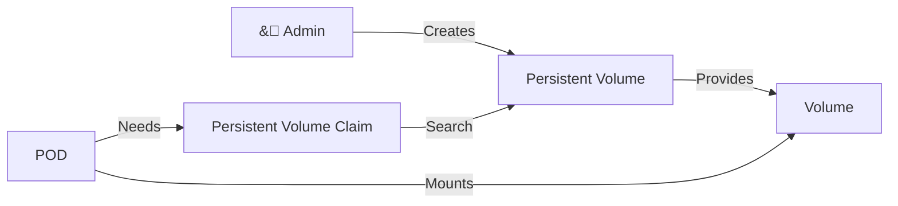
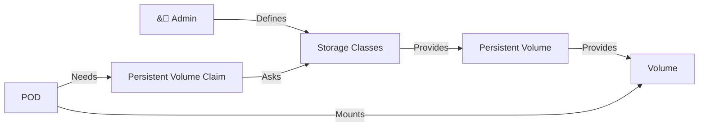

# Volumes

## Static Provisioning



## Dynamic Provisioning



## Get resources

```bash
# Get storage classes
kubectl get storageclasses # or kubectl get sc

# Get persistent volumes
kubectl get persistentvolumes # or kubectl get pv

# Get persistent volume claims
kubectl get persistentvolumeclaims # or kubectl get pvc
```

## Configmap

### Get configmaps

`kubectl get configmap`

or

`kubectl get cm`

## Secret

### Get secrets

`kubectl get secrets`